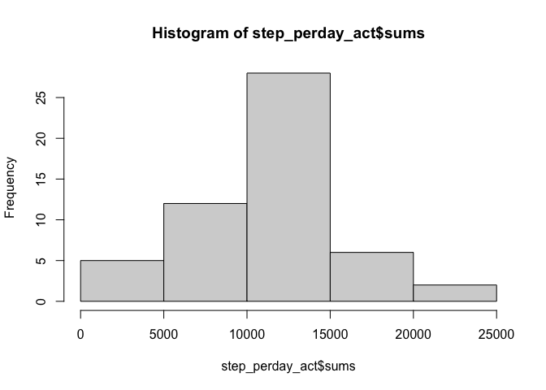
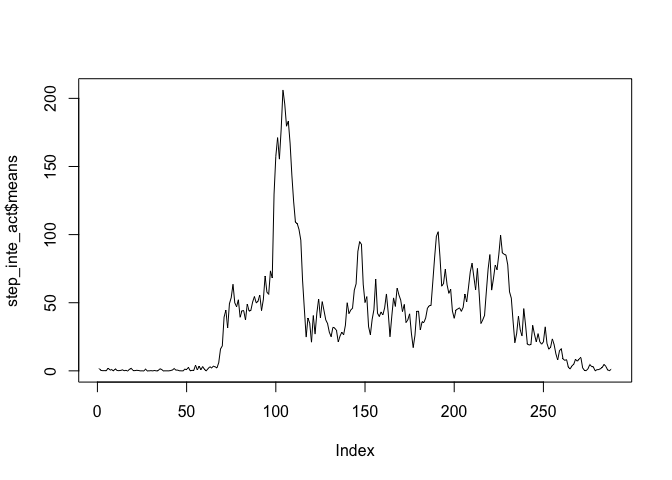
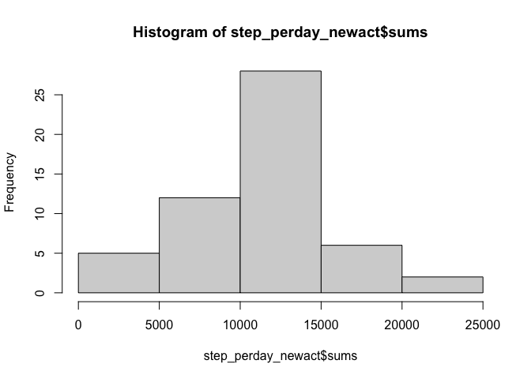
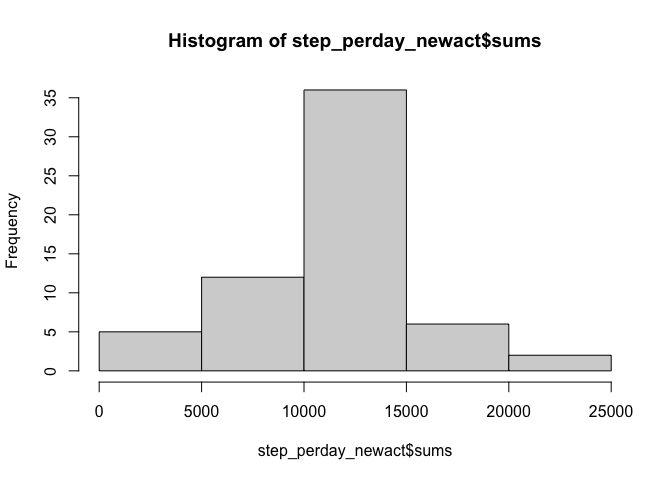
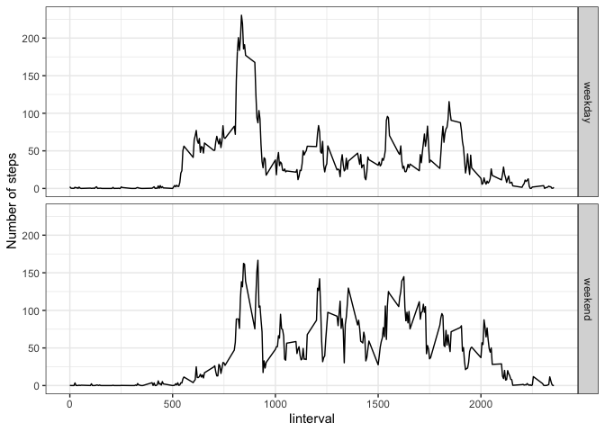

## Loading and preprocessing the data

```r
unzip_activity <- unzip("./activity.zip")
act <- read.csv(unzip_activity)
head(act)
```

```
##   steps       date interval
## 1    NA 2012-10-01        0
## 2    NA 2012-10-01        5
## 3    NA 2012-10-01       10
## 4    NA 2012-10-01       15
## 5    NA 2012-10-01       20
## 6    NA 2012-10-01       25
```

```r
tail(act)
```

```
##       steps       date interval
## 17563    NA 2012-11-30     2330
## 17564    NA 2012-11-30     2335
## 17565    NA 2012-11-30     2340
## 17566    NA 2012-11-30     2345
## 17567    NA 2012-11-30     2350
## 17568    NA 2012-11-30     2355
```

## What is mean total number of steps taken per day?

```r
library(dplyr)
```

```
## 
## Attaching package: 'dplyr'
```

```
## The following objects are masked from 'package:stats':
## 
##     filter, lag
```

```
## The following objects are masked from 'package:base':
## 
##     intersect, setdiff, setequal, union
```

```r
day_act <- group_by(act, date)
step_perday_act <- summarize(day_act, sums = sum(steps), means=mean(steps), medians=median(steps))
hist(step_perday_act$sums)
```

<!-- -->

```r
step_perday_act$means 
```

```
##  [1]         NA  0.4375000 39.4166667 42.0694444 46.1597222 53.5416667
##  [7] 38.2465278         NA 44.4826389 34.3750000 35.7777778 60.3541667
## [13] 43.1458333 52.4236111 35.2048611 52.3750000 46.7083333 34.9166667
## [19] 41.0729167 36.0937500 30.6284722 46.7361111 30.9652778 29.0104167
## [25]  8.6527778 23.5347222 35.1354167 39.7847222 17.4236111 34.0937500
## [31] 53.5208333         NA 36.8055556 36.7048611         NA 36.2465278
## [37] 28.9375000 44.7326389 11.1770833         NA         NA 43.7777778
## [43] 37.3784722 25.4722222         NA  0.1423611 18.8923611 49.7881944
## [49] 52.4652778 30.6979167 15.5277778 44.3993056 70.9270833 73.5902778
## [55] 50.2708333 41.0902778 38.7569444 47.3819444 35.3576389 24.4687500
## [61]         NA
```

```r
step_perday_act$medians
```

```
##  [1] NA  0  0  0  0  0  0 NA  0  0  0  0  0  0  0  0  0  0  0  0  0  0  0  0  0
## [26]  0  0  0  0  0  0 NA  0  0 NA  0  0  0  0 NA NA  0  0  0 NA  0  0  0  0  0
## [51]  0  0  0  0  0  0  0  0  0  0 NA
```

## What is the average daily activity pattern?

```r
inte_act <- group_by(act, interval)
step_inte_act <- summarize(inte_act, means = mean(steps, na.rm=TRUE))
plot(step_inte_act$means, type="l")
```

<!-- -->

```r
step_inte_act[which(step_inte_act$means==max(step_inte_act$means)),]
```

```
## # A tibble: 1 x 2
##   interval means
##      <int> <dbl>
## 1      835  206.
```

## Imputing missing values

```r
sum(is.na(act$steps))
```

```
## [1] 2304
```
### Devise a strategy for filling mean of that day in all of the missing values in the dataset

```r
new_act <- act
act_row <- nrow(act)
for (i in 1:act_row){
  if(is.na(new_act[i, ]$steps)){
    na_date <- new_act[i, ]$date
    new_act[i, ]$steps <- step_perday_act[step_perday_act$date ==na_date, ]$means
  }
}
```

### mean and median of the new_act dateframe

```r
library(dplyr)
day_newact <- group_by(new_act, date)
step_perday_newact <- summarize(day_newact, sums = sum(steps), means=mean(steps), medians=median(steps))
hist(step_perday_newact$sums)
```

<!-- -->

```r
step_perday_newact$means 
```

```
##  [1]         NA  0.4375000 39.4166667 42.0694444 46.1597222 53.5416667
##  [7] 38.2465278         NA 44.4826389 34.3750000 35.7777778 60.3541667
## [13] 43.1458333 52.4236111 35.2048611 52.3750000 46.7083333 34.9166667
## [19] 41.0729167 36.0937500 30.6284722 46.7361111 30.9652778 29.0104167
## [25]  8.6527778 23.5347222 35.1354167 39.7847222 17.4236111 34.0937500
## [31] 53.5208333         NA 36.8055556 36.7048611         NA 36.2465278
## [37] 28.9375000 44.7326389 11.1770833         NA         NA 43.7777778
## [43] 37.3784722 25.4722222         NA  0.1423611 18.8923611 49.7881944
## [49] 52.4652778 30.6979167 15.5277778 44.3993056 70.9270833 73.5902778
## [55] 50.2708333 41.0902778 38.7569444 47.3819444 35.3576389 24.4687500
## [61]         NA
```

```r
step_perday_newact$medians
```

```
##  [1] NA  0  0  0  0  0  0 NA  0  0  0  0  0  0  0  0  0  0  0  0  0  0  0  0  0
## [26]  0  0  0  0  0  0 NA  0  0 NA  0  0  0  0 NA NA  0  0  0 NA  0  0  0  0  0
## [51]  0  0  0  0  0  0  0  0  0  0 NA
```

### why new_act is not different from act

```r
table(act[is.na(act$steps), ]$date)
```

```
## 
## 2012-10-01 2012-10-08 2012-11-01 2012-11-04 2012-11-09 2012-11-10 2012-11-14 
##        288        288        288        288        288        288        288 
## 2012-11-30 
##        288
```

#### on the day when there is any NA data, there is no other data then NA. So, the new_act datafrem didn't change
### So, I changed the way of filling NA data. I devised a strategy for filling mean of the 5-minutes interval in all of the missing values in the dataset

```r
new_act <- act
act_row <- nrow(act)
for (i in 1:act_row){
  if(is.na(new_act[i, ]$steps)){
    na_inte <- new_act[i, ]$interval
    new_act[i, ]$steps <- step_inte_act[step_inte_act$interval ==na_inte, ]$means
  }
}
```

### mean and median of the new_act dateframe

```r
library(dplyr)
day_newact <- group_by(new_act, date)
step_perday_newact <- summarize(day_newact, sums = sum(steps), means=mean(steps), medians=median(steps))
hist(step_perday_newact$sums)
```

<!-- -->

```r
step_perday_newact$means 
```

```
##  [1] 37.3825996  0.4375000 39.4166667 42.0694444 46.1597222 53.5416667
##  [7] 38.2465278 37.3825996 44.4826389 34.3750000 35.7777778 60.3541667
## [13] 43.1458333 52.4236111 35.2048611 52.3750000 46.7083333 34.9166667
## [19] 41.0729167 36.0937500 30.6284722 46.7361111 30.9652778 29.0104167
## [25]  8.6527778 23.5347222 35.1354167 39.7847222 17.4236111 34.0937500
## [31] 53.5208333 37.3825996 36.8055556 36.7048611 37.3825996 36.2465278
## [37] 28.9375000 44.7326389 11.1770833 37.3825996 37.3825996 43.7777778
## [43] 37.3784722 25.4722222 37.3825996  0.1423611 18.8923611 49.7881944
## [49] 52.4652778 30.6979167 15.5277778 44.3993056 70.9270833 73.5902778
## [55] 50.2708333 41.0902778 38.7569444 47.3819444 35.3576389 24.4687500
## [61] 37.3825996
```

```r
step_perday_newact$medians
```

```
##  [1] 34.11321  0.00000  0.00000  0.00000  0.00000  0.00000  0.00000 34.11321
##  [9]  0.00000  0.00000  0.00000  0.00000  0.00000  0.00000  0.00000  0.00000
## [17]  0.00000  0.00000  0.00000  0.00000  0.00000  0.00000  0.00000  0.00000
## [25]  0.00000  0.00000  0.00000  0.00000  0.00000  0.00000  0.00000 34.11321
## [33]  0.00000  0.00000 34.11321  0.00000  0.00000  0.00000  0.00000 34.11321
## [41] 34.11321  0.00000  0.00000  0.00000 34.11321  0.00000  0.00000  0.00000
## [49]  0.00000  0.00000  0.00000  0.00000  0.00000  0.00000  0.00000  0.00000
## [57]  0.00000  0.00000  0.00000  0.00000 34.11321
```

## Are there differences in activity patterns between weekdays and weekends?

```r
library(lubridate)
```

```
## 
## Attaching package: 'lubridate'
```

```
## The following objects are masked from 'package:base':
## 
##     date, intersect, setdiff, union
```

```r
library(ggplot2)
library(dplyr)
weekday_vec <- c("Mon","Tue","Wed","Thu","Fri")
weekend_vec <- c("Sat", "Sun")
weekday <- data.frame()
weekend <- data.frame()

for (i in 1:nrow(new_act)){
  if (wday(new_act[i,]$date,label=TRUE,locale = "en_US.UTF-8") %in% weekday_vec){
    weekday <- bind_rows(weekday, new_act[i,])
  }
  else{
    weekend <- bind_rows(weekend, new_act[i,])
  }
}

inte_weekend <- group_by(weekend, interval)
step_inte_weekend <- summarize(inte_weekend, means = mean(steps))
step_inte_weekend$wday <- "weekend"
inte_weekday <- group_by(weekday, interval)
step_inte_weekday <- summarize(inte_weekday, means = mean(steps))
step_inte_weekday$wday <- "weekday"

final_act <- bind_rows(step_inte_weekend, step_inte_weekday)
p_0 <- ggplot(final_act, aes(x = interval, y = means)) +geom_line()+facet_grid(rows = vars(wday))+ theme_bw() 
p_0 +labs(x = "Iinterval", y = "Number of steps")
```

<!-- -->
